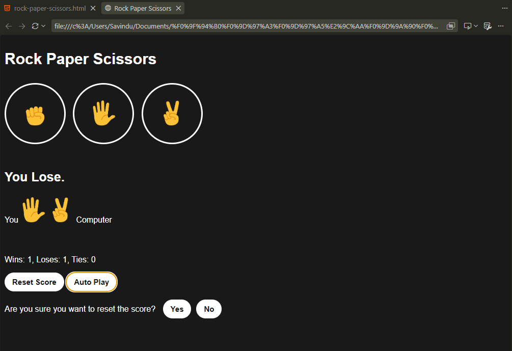

# ✊🖐✌️ Rock-Paper-Scissors JS

A lightweight, interactive Rock-Paper-Scissors game built using vanilla JavaScript, HTML5, and CSS3. Play against the computer, track your score, and try to maintain a winning streak!

---

## 🚀 Features

* **Interactive Gameplay:** Play against an automated computer opponent with randomized selections.
* **Score Tracking:** Real-time tracking of wins, losses, and ties.
* **Persistent State:** Saves game scores locally using `localStorage` so your progress isn't lost on page refresh.
* **Keyboard Shortcuts:** Fast-paced play supported via keyboard controls (`R` for Rock, `P` for Paper, `S` for Scissors).
* **Reset & Auto-Play Options:** Reset the game score at any time or let the game auto-play itself.

---

## 🛠️ Tech Stack

* **HTML5:** Game structure and semantic layout.
* **CSS3:** Responsive styling and visual design.
* **JavaScript (ES6+):** Game logic, event listeners, and dynamic DOM manipulation.

---

## 🚀 Screenshots

>   

---

## 💻 Getting Started

### Prerequisites

No special installation or local server is required! You only need a modern web browser (such as Chrome, Firefox, Safari, or Edge).

### Installation

1. **Clone the repository:**
  `git clone [https://github.com/DevilSavi/rock-paper-scissors-js.git](https://github.com/DevilSavi/rock-paper-scissors-js.git)`


2. **Navigate to the project directory:**
  ``cd rock-paper-scissors-js``

3. **Run the game:**
  Open `rock-paper-scissors.html` directly in your browser, or use an extension like **Live Server** in VS Code.

---

## 🎮 How to Play

1. **Make a Move:** Click on one of the action buttons—**Rock**, **Paper**, or **Scissors**.

2. **Rules:**
* **Rock** beats Scissors
* **Paper** beats Rock
* **Scissors** beats Paper

3. **Score:** View your updated score and round outcome instantly on the screen.
4. **Auto Play:** Click the **Auto Play** button to sit back and watch the computer battle itself!
5. **Reset:** Click **Reset Score** to set all stats back to zero.

---

## 🕹️ Shortcut Keys

| Action | Key / Control |
|---|---|
| Rock | R |
| Paper | P |
| Scissors | S |
| Auto play | A |
| Stop (Auto play) | A |
| Reset Score | Backspace |
| Yes (Reset Score) | Y |
| No (Reset Score) | N |

---

## 📁 Project Structure

```
rock-paper-scissors-js/
│
├── rock-paper-scissors.html     # Main HTML structure
├── style.css                    # Styles and layouts
├── script.js                    # Core game logic & event 
|
├── images/                      # Game icons and assets
└── README.md                    # Project documentation

```

---

## 📄 License

Distributed under the MIT License. See `LICENSE` for more information.

> Copyright © Savindu Nethmika. 
> All Right Reserved.
